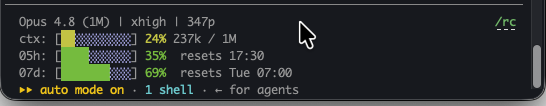

# Operating Modes — how I actually drive Code-X

> A companion to the [README](README.md). The README explains *what* Code-X is; this is *how I personally run it* day-to-day, as the non-coder directing it.
>
> **Code-X is model-agnostic by design.** Claude Code and Codex are the first supported engines because they're the tools I use — the protocol isn't tied to one vendor, one model, or one fixed Claude→Codex pipeline. So nothing below is a requirement. It's one operator's preferences, shared because *"which tool, when?"* is the question I get asked most.

This is about what **you**, the human director, actually do. Code-X and the AI session handle the protocol machinery — state, active-engine records, work-order routing, checks, handoffs, gates. You shouldn't have to hand-edit those files unless the AI asks you to review or approve something. You own the product judgment; the system owns the mechanics.

A note on commands: `ultracode` / `/effort` (Claude Code) and `/goal` (Codex) below are features of *those tools*, not Code-X commands — if your setup doesn't have them, use its equivalent or just prompt plainly.

One habit at every stage: **start the session by naming what you want + Code-X** — the **Start with** line under each stage shows how.

---

## Planning Stage — your highest-leverage work

> **Start with:** *"Plan a new app called [name] with Code-X."*

Planning is where you should spend the most attention.

My preferred Planning Stage setup is **Claude Code** — for product taste, architecture, resolving ambiguity, writing clear planning artifacts, and turning my intent into a locked packet and Master Blueprint.

Your job in Planning:

1. Be meticulous.
2. Read the planning outputs carefully.
3. Direct the AI plainly when something doesn't match your vision.
4. Push until requirements, business logic, UI/UX, screens, flows, edge cases, data rules, security assumptions, and acceptance criteria are concrete.
5. Review the Master Blueprint before any build starts.
6. Do **not** let build begin while the plan still feels vague, wrong, incomplete, or not truly yours.

The AI can write the planning artifacts, but it can't own your product judgment. The plan must be specific enough that the builder is executing *your* vision, not inventing one.

### After Master Blueprint approval — compile the work-order cards

Once I approve the Master Blueprint and it's time to compile the work-order cards, I use Claude Code's **`ultracode`** mode (if your plan/version has it):

```
/effort ultracode
```

This is where the plan gets compressed into buildable cards, so the extra reasoning is worth the cost. The card deck must *preserve* the approved plan, not summarize it loosely.

---

## Building Stage — first preference: Codex with `/goal`

> **Start with:** *"Build [project] with Code-X — from the locked plan or latest handoff."*

My first preference for the Building Stage is **Codex with `/goal`**.

To be clear, this is a *capacity* preference, not a claim that Codex builds better. Code-X's second principle is efficiency, and in my current setup Codex gives me more usable long-run build capacity than my Claude subscription does. Your economics may differ — pick whichever engine gives you the most build runway.

What I do when building with Codex:

1. Open the project in Codex.
2. Build with Code-X from the locked plan or the latest handoff.
3. Use `/goal` for the build goal.
4. Tell Codex to continue the current Code-X build-stage work.
5. Let it run the bounded build work.
6. Review the outputs, module demos, and approval checkpoints when Code-X asks.
7. Redirect only when the result drifts from the plan, the product judgment is wrong, or Code-X asks for a human decision.

The reason I reach for it first is Codex's long autonomous behavior: it runs, compacts, continues, executes commands, and keeps working through longer build runs with less babysitting. Fewer interrupted sessions means less waste — which is the efficiency goal.

## Building Stage — second preference: Claude Code with `ultracode`

My second build preference is **Claude Code with `ultracode`**.

This isn't a "only if Codex fails" fallback — it's powerful, just heavier on my Claude session capacity. Same efficiency logic: Codex first for long runs, Claude Code `ultracode` second for substantive build work.

What I do when building with Claude Code:

1. Start Claude Code in the project.
2. Build with Code-X from the locked plan or the latest handoff.
3. Use `ultracode` for substantive build work:
   ```
   /effort ultracode
   ```
4. **Watch the context window.** I use a Claude Code statusline to monitor it (see below). I try to save and stop at a clean point when context is roughly between **250k and 450k tokens**, to prevent context rot.
5. Watch what Claude says — especially warnings, uncertainty, skipped checks, open findings, and handoff notes.
6. At a clean stopping point, tell Claude to finish honestly:
   - complete the current card or stop cleanly;
   - update state;
   - write the handoff;
   - produce the paste-ready resume prompt.
7. Start a fresh session, paste the resume prompt, and continue.
8. Repeat until the build reaches the next real gate or approval point.

The difference from Codex is that Claude Code, in my workflow, needs more active session management — I have to manage continuity myself.

**My statusline:**



It shows the model and effort, the live context window (here `237k / 1M`, 24%), and how much of my 5-hour and 7-day limits I've burned. That one line is what tells me when to save and hand off.

**Set one up:** Claude Code supports a custom status line — run `/statusline`, or point the `statusLine` setting at a small script that prints what you want. Show the live context number at minimum; that single figure is the signal for when to wrap up cleanly. (Mine adds the 5-hour / 7-day usage windows too — useful, but the context number is the one that matters.)

<details>
<summary><strong>Optional: my exact statusline script</strong> (bash · needs <code>jq</code> · optional <code>ccusage</code> for the usage bars)</summary>

Save it as `~/.claude/statusline-command.sh`, then point your `statusLine` setting at it:

```json
"statusLine": { "type": "command", "command": "bash ~/.claude/statusline-command.sh" }
```

It reads the JSON Claude Code pipes to a statusline command (model, context window, rate limits) and draws four rows. Tune the thresholds in `color_for_ctx` to your context size — mine flips to red at 25% because I run a 1M-token window.

```bash
#!/usr/bin/env bash
# Claude Code statusline — 4 rows: model|effort|prompts · context · 5h limit · 7d limit
# Deps: jq (required). Optional: npx ccusage — a fallback for the rate-limit % when
#       Claude Code doesn't supply rate_limits in the statusline JSON.
# Tune color_for_ctx thresholds to your context size (mine flips red at 25% on a 1M window).

input=$(cat)

# ── helpers ──────────────────────────────────────────────────────────────────

color_for_ctx() {
  local pct="${1:-0}"
  local p
  p=$(printf '%.0f' "$pct")
  if   [ "$p" -lt 10 ]; then printf '\033[34m'   # blue
  elif [ "$p" -lt 15 ]; then printf '\033[32m'   # dark green
  elif [ "$p" -lt 20 ]; then printf '\033[92m'   # bright green
  elif [ "$p" -lt 25 ]; then printf '\033[33m'   # yellow
  else                       printf '\033[31m'   # red
  fi
}

color_for_rate() {
  local pct="${1:-0}"
  local p
  p=$(printf '%.0f' "$pct")
  if   [ "$p" -lt 70 ]; then printf '\033[32m'   # green
  elif [ "$p" -lt 90 ]; then printf '\033[33m'   # yellow
  else                       printf '\033[31m'   # red
  fi
}

# make_bar <pct 0-100> <fill_color_escape> → 10-char block bar
# filled blocks: progress color; empty blocks: light blue
make_bar() {
  local pct="${1:-0}"
  local color="${2:-}"
  local reset='\033[0m'
  local light_blue='\033[94m'
  local filled
  filled=$(echo "$pct" | awk '{f=int($1/10+0.5); if(f>10)f=10; print f}')
  local empty=$((10 - filled))
  local bar=""
  local i

  if [ -n "$color" ] && [ "$filled" -gt 0 ]; then
    bar+=$(printf '%b' "$color")
    for ((i=0; i<filled; i++)); do bar+="█"; done
    bar+=$(printf '%b' "$reset")
  else
    for ((i=0; i<filled; i++)); do bar+="█"; done
  fi

  if [ "$empty" -gt 0 ]; then
    bar+=$(printf '%b' "$light_blue")
    for ((i=0; i<empty; i++)); do bar+="░"; done
    bar+=$(printf '%b' "$reset")
  fi

  printf '%s' "$bar"
}

# colored_pct <pct> <color_escape_bytes> → percentage string in that color
colored_pct() {
  local pct="${1:-0}"
  local color="$2"
  local reset
  reset=$(printf '\033[0m')
  printf '%s%.0f%%%s' "$color" "$pct" "$reset"
}

fmt_tok() {
  local n="${1:-0}"
  echo "$n" | awk '{
    if ($1 >= 1000000) {
      v = $1 / 1000000
      rounded = int(v * 10 + 0.5) / 10
      if (rounded == int(rounded)) printf "%dM", int(rounded)
      else printf "%.1fM", rounded
    } else if ($1 >= 1000) {
      printf "%dk", int($1 / 1000 + 0.5)
    } else {
      printf "%d", $1
    }
  }'
}

fmt_epoch_hm() {
  local epoch="$1"
  [ -z "$epoch" ] && { printf '??:??'; return; }
  date -r "$epoch" '+%H:%M' 2>/dev/null || date -d "@$epoch" '+%H:%M' 2>/dev/null || printf '??:??'
}

fmt_epoch_day_hm() {
  local epoch="$1"
  [ -z "$epoch" ] && { printf '??? ??:??'; return; }
  date -r "$epoch" '+%a %H:%M' 2>/dev/null || date -d "@$epoch" '+%a %H:%M' 2>/dev/null || printf '??? ??:??'
}

# ── parse JSON ────────────────────────────────────────────────────────────────

model=$(echo "$input" | jq -r '.model.display_name // "Claude"' | sed 's/ context//')

effort=$(echo "$input" | jq -r '
  (.model.effort // .effort // .reasoning_effort // empty)
  | if type == "object" then (.level // .value // empty) else . end
')

# Prompt count — file-based counter that increments each statusline call.
# Keyed by session_id (if available) or transcript_path hash, so each
# conversation gets its own counter that never resets mid-session.
session_id=$(echo "$input" | jq -r '.session_id // empty')
transcript_path=$(echo "$input" | jq -r '.transcript_path // empty')

if [ -n "$session_id" ]; then
  session_key=$(printf '%s' "$session_id" | tr -cd '[:alnum:]-_' | cut -c1-16)
elif [ -n "$transcript_path" ]; then
  session_key=$(printf '%s' "$transcript_path" | md5 2>/dev/null | cut -c1-8 || \
                printf '%s' "$transcript_path" | md5sum 2>/dev/null | cut -c1-8 || \
                printf 'default')
else
  session_key="default"
fi

counter_file="/tmp/cc_prompts_${session_key}"
if [ -f "$counter_file" ]; then
  prompts=$(( $(cat "$counter_file" 2>/dev/null || echo 0) + 1 ))
else
  prompts=1
fi
printf '%d' "$prompts" > "$counter_file"

# Context window
used_tok=$(echo "$input" | jq -r '.context_window.total_input_tokens // empty')
total_tok=$(echo "$input" | jq -r '.context_window.context_window_size // empty')
used_pct=$(echo "$input" | jq -r '.context_window.used_percentage // empty')

# Rate limits — native JSON first
five_h_pct=$(echo "$input" | jq -r '.rate_limits.five_hour.used_percentage // empty')
five_h_reset=$(echo "$input" | jq -r '.rate_limits.five_hour.resets_at // empty')
seven_d_pct=$(echo "$input" | jq -r '.rate_limits.seven_day.used_percentage // empty')
seven_d_reset=$(echo "$input" | jq -r '.rate_limits.seven_day.resets_at // empty')

# ccusage fallback if native limits absent
if [ -z "$five_h_pct" ] && [ -z "$seven_d_pct" ]; then
  ccusage_out=$(npx -y ccusage@latest statusline 2>/dev/null || true)
  if [ -n "$ccusage_out" ]; then
    five_h_pct=$(echo "$ccusage_out" | grep -oE '5h:[0-9.]+%' | grep -oE '[0-9.]+' || true)
    seven_d_pct=$(echo "$ccusage_out" | grep -oE '7d:[0-9.]+%' | grep -oE '[0-9.]+' || true)
  fi
fi

# ── Row 1: model | effort | prompts ──────────────────────────────────────────
row1="$model"
[ -n "$effort" ] && row1="$row1 | $effort"
row1="$row1 | ${prompts}p"

# ── Row 2: ctx: [bar] X% used / total ────────────────────────────────────────
if [ -n "$used_pct" ] || [ -n "$used_tok" ]; then
  pct_val="${used_pct:-0}"
  ctx_color=$(color_for_ctx "$pct_val")
  bar=$(make_bar "$pct_val" "$ctx_color")
  pct_str=$(colored_pct "$pct_val" "$ctx_color")
  if [ -n "$used_tok" ] && [ -n "$total_tok" ]; then
    tok_label="$(fmt_tok "$used_tok") / $(fmt_tok "$total_tok")"
    row2="ctx: [${bar}] ${pct_str} ${tok_label}"
  else
    row2="ctx: [${bar}] ${pct_str}"
  fi
else
  row2="ctx: —"
fi

# ── Row 3: 05h: [bar] X%  resets HH:MM ──────────────────────────────────────
if [ -n "$five_h_pct" ]; then
  rate_color=$(color_for_rate "$five_h_pct")
  bar=$(make_bar "$five_h_pct" "$rate_color")
  pct_str=$(colored_pct "$five_h_pct" "$rate_color")
  reset_str=""
  [ -n "$five_h_reset" ] && reset_str="  resets $(fmt_epoch_hm "$five_h_reset")"
  row3="05h: [${bar}] ${pct_str}${reset_str}"
else
  row3="05h: —"
fi

# ── Row 4: 07d: [bar] X%  resets Day HH:MM ──────────────────────────────────
if [ -n "$seven_d_pct" ]; then
  rate_color=$(color_for_rate "$seven_d_pct")
  bar=$(make_bar "$seven_d_pct" "$rate_color")
  pct_str=$(colored_pct "$seven_d_pct" "$rate_color")
  reset_str=""
  [ -n "$seven_d_reset" ] && reset_str="  resets $(fmt_epoch_day_hm "$seven_d_reset")"
  row4="07d: [${bar}] ${pct_str}${reset_str}"
else
  row4="07d: —"
fi

# ── Output ────────────────────────────────────────────────────────────────────
printf '%s\n%s\n%s\n%s' "$row1" "$row2" "$row3" "$row4"
```

</details>

---

## Fixing Stage — preserve, don't rebuild

> **Start with:** *"Fix [defect] in [project] with Code-X."*

Fixing is different from building. The posture flips from *create* to *preserve*.

1. Use Code-X's Fixing Stage when repairing something already built.
2. Describe the defect clearly.
3. Watch for any sign the AI is changing more than the defect.
4. If the fix touches product judgment, money rules, security, data, or UI taste, review it carefully before accepting.

A good fix changes only the defect. Anything beyond it is drift — unless Code-X has explicitly turned it into a new planned change.

---

## Between sessions — handoff first

Before ending a session, make sure the AI writes a clean Code-X handoff and the paste-ready resume prompt for the next one.

What you do:

1. Ask the AI to end cleanly with a Code-X handoff.
2. Save the resume prompt it prints.
3. Next session, in the same project, paste the prompt and let the AI read the handoff + state before continuing.

### How I do it: a one-word `/save`

Code-X deliberately does **not** ship a `/save` command (automation varies too much by setup), so I built my own. One word ends a session cleanly — when I type `/save` it:

- writes the full Code-X handoff (from the shipped `templates/HANDOFF.template.md`) into `handoffs/`;
- rewrites a one-line **STATUS** — where I am + the next action;
- prints a tiny **resume prompt** for the next session;
- syncs a short summary into my personal notes vault *(my setup only — optional)*.

The first three are pure Code-X; the vault sync is just mine.

### Build your own

A Claude Code skill is one folder with one file. Create `~/.claude/skills/save/SKILL.md`:

```markdown
---
name: save
description: End the session cleanly — write a Code-X handoff + resume prompt. Use on "save" or "/save".
---

When invoked:
1. Fill templates/HANDOFF.template.md with this session's status, files changed,
   verification, and open issues; write it to handoffs/handoff-<date>.md.
2. Update CODE-X-STATE.yaml if the stage or card changed.
3. Print a one-line resume prompt naming that handoff.
```

Then type `/save` (or just "save") to run it. That's the portable core for continuity — add your own steps (notes sync, git, lint) once it works.

In a Building Stage, also run `cx check close-turn` — Code-X's turn-end gate. It confirms the handoff carries its required `close_turn` details: open findings, evidence paths, the resume prompt, and where the work is saved. The point isn't the command name; it's that one word reliably produces a handoff that passes the gate, so the next session starts from truth, not memory.

---

## When limits force a switch

The protocol is model-agnostic, so switching engines mid-project is fine.

- If Codex hits limits, continue the build in Claude Code.
- If Claude hits limits, continue planning in Codex.
- Use the latest Code-X handoff / resume prompt to continue.
- Tell the new session whether you're in the Planning, Building, or Fixing Stage with Code-X.
- Let the AI session handle the state update, engine record, work-order branch, and checks.

Don't hand-rewrite the protocol state unless you know exactly why. Your job is to choose the available tool, paste the handoff, and direct the AI.

---

## What Code-X handles internally (not your job)

The guide above is about *your* actions. Everything below is the AI session's job, not yours — and it differs by stage. If Code-X ever hands one of these to *you*, treat it as a protocol failure, a handoff issue, or a decision checkpoint — not ordinary work.

**Every stage** — the machinery that always runs:

- maintains `CODE-X-STATE.yaml` (the project's current-state file);
- runs or requests the right `cx` checks (the deterministic Python gatekeeper);
- updates state and writes the handoff + resume prompt at session end;
- raises a STOP card instead of asking you to debug.

**Planning Stage** — turning your intent into a locked, buildable plan:

- drafts the requirements packet, the decisions, the security baseline, and the screen designs;
- generates the **Master Blueprint** from that plan — always rendered from the source, never hand-typed;
- freezes and fingerprints (hashes) the plan, so nothing can change later unseen;
- compiles the work-order card deck and proves *reverse coverage* — every requirement marked for building has a card, so nothing slated to be built was silently dropped (gate **G1**).

**Building Stage** — building only what the locked plan specifies:

- records which engine is active (Claude Code or Codex) and the model/effort each card uses;
- hands the AI **one work-order card at a time** — never the whole plan at once;
- runs deterministic checks on every card, then self-review and an opposite-family review at each module boundary;
- demos each finished module for your approval, seals it, and moves to the next;
- produces the evidence paths for what was built, and **blocks the build the moment a gate fails** — through to the final-ready certificate.

**Fixing Stage** — repairing without drifting:

- pins each fix to **one** named target; everything else is cross-locked so it can't be touched;
- freezes the file tree (`cx check structure`) so no file is moved or renamed unseen;
- requires a file-backed ledger-search receipt before re-asking you anything already settled (anti-amnesia);
- treats any change beyond the named defect as a failure, not a bonus.

---

## The one-line rule

> **You direct the product. Code-X directs the AI. Workers build. The orchestrator verifies. `cx` gates. You approve product judgment.**
